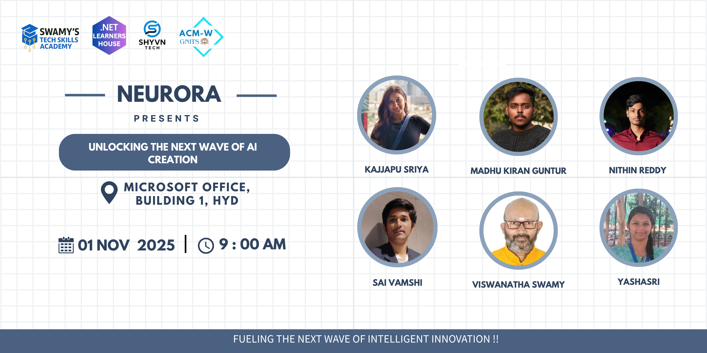
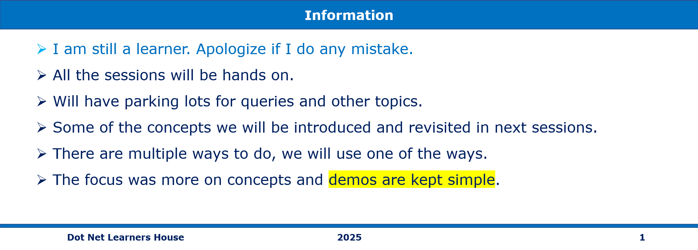
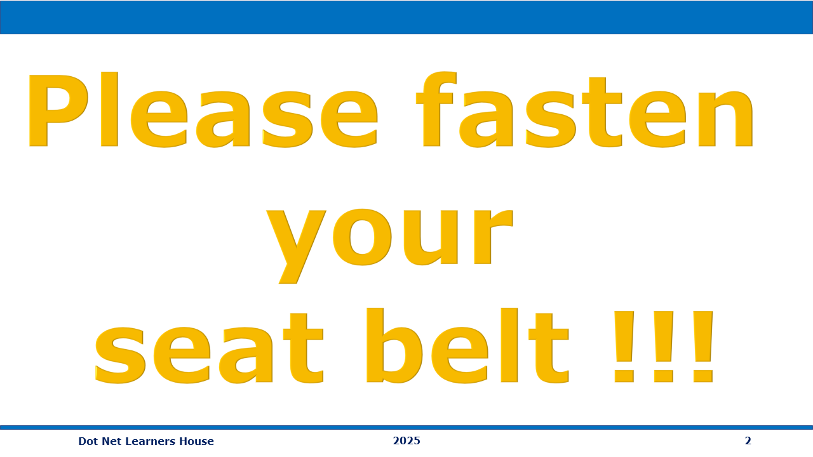

# 🚀 Global AI Bootcamp – Prompt Engineering with LangChain

📅 **Date:** 14 June 2025  
🕙 **Time:** 10:00 AM IST  
📍 **Location:** Microsoft, Hyderabad   
🔗 **Event Link:** [Register on Meetup](https://www.meetup.com/dot-net-learners-house-hyderabad/events/308109558/?eventOrigin=group_events_list)

**Speaker:** Nithin Reddy  
**Topic:** **Real-World Applications & Ethical Considerations**  
🛠️ **Live Demo:** LangChain in Action!

 

---

### Software/Tools

> 1. OS: Windows 10/11 x64
> 1. Python / .NET 8
> 1. Visual Studio 2022
> 1. Visual Studio Code

### Prior Knowledge

> 1. Programming knowledge in C# / Python

## Technology Stack

> 1. .NET 8, AI, Open AI

---



---

### What are we doing today?
1. How Prompt Engineering is used in chatbots, content generation, and coding assistants.
2. Ethical considerations – Bias, misinformation, and responsible AI usage.
3. How developers can fine-tune prompts for better AI interactions.
4. Hands on demo's

---



---

## 🧠 Session Overview

Prompting is the art of crafting clear instructions for AI models using natural language.
It helps guide the model's reasoning, improve accuracy, and ensure structured and relevant responses.

So let's explore some real-world examples.

---

## 🧰 Chatbots

```text
Poor Approach

"Your flight is canceled."

Correct approach:

"You are a customer support assistant for an airline. A passenger's flight got canceled. Apologize, offer a refund or rebooking, and sign off professionally."
```

---

### Content Generation

```text
Poor Approach 

"Write a comment for the water bottle function."

Correct Approach

"Write a 100-word docstring for a function that handles orders for an eco-friendly stainless steel bottle in a fitness e-commerce app."
```

---

### Code Assistants

```text
Poor Approach

"Explain this Python function to a beginner: def is_prime(n): ..."

Correct Approach

"Create a JavaScript function that validates email addresses."
```

---

### Ethical Considerations 

```text
Poor Approach 

"Write a full authentication module."

Correct Approach

"Generate a basic user authentication module in Python without using any code from copyrighted or licensed repositories. Follow MIT-style examples only."
```

---

### Hallucinations 

```text
Poor Approach

"Write code to get all pending invoices from an API."

Correct Approach

"Assume you're working with a REST API with a 'GET /invoices' endpoint that returns invoice objects with a 'status' field. Write Python code using requests to fetch and list invoices where status == 'pending'. If unsure, return a note."
```
    
---

### Responsible Prompting

Whether you're coding, writing a health report, or generating an essay —
how you frame your prompt matters.

Use role-based prompts. For example:

"You are a coding assistant."
"You are a chef."
"You are a certified doctor."

It helps the AI generate more relevant and accurate content.

```text
Poor Approach 

"Write Python code to calculate freelance tax in India."

Correct Approach

"You are a coding assistant, not a certified financial advisor. Generate Python code that calculates freelance income tax deductions in India, and include a disclaimer. Base the logic on India's latest 2024 IT rules and link to the official source."
```

## 🖼️ Resources for reference 
1. [Prompt Engineering Guide – Covers fundamentals, techniques, and best practices.](https://www.promptingguide.ai/)
2. [Prompt Engineering Tutorial – A beginner-friendly guide with practical examples.](https://www.tutorialspoint.com/prompt_engineering/index.html)
3. [Basic Prompt Engineering – Explains different prompting techniques with examples.](https://aiengineering.academy/PromptEngineering/Basic_Prompting/)

---

## 🙌 Acknowledgements

- **Organized by:** Global AI Secunderabad
- **Supported by:** DotNet Learners House Hyderabad  
- **Special thanks:** All participants and volunteers

---

## 🔗 Stay Connected

- [LinkedIn – Nithin Reddy](https://www.linkedin.com/in/nithin-reddy1/)
- [Global AI secunderabad](https://www.meetup.com/global-ai-secunderabad/)
- [Dot Net Learner House](https://www.meetup.com/dot-net-learners-house-hyderabad/)
- Contact: nithinreddy3630@gmail.com

---
