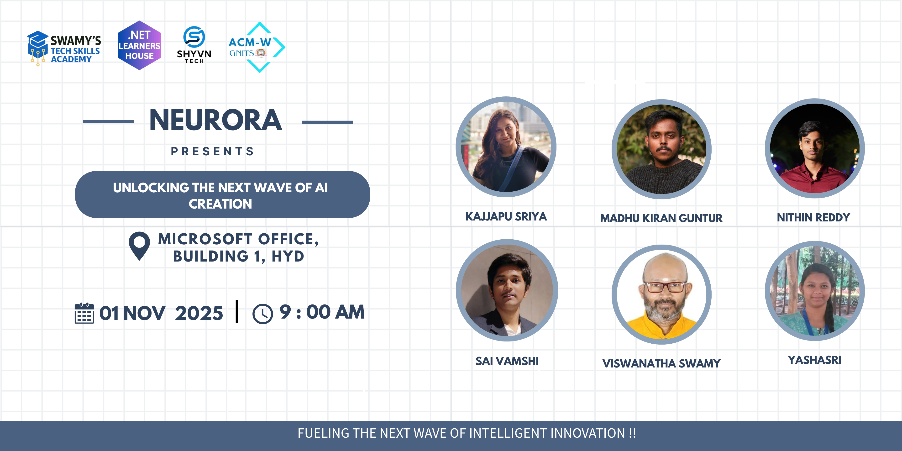
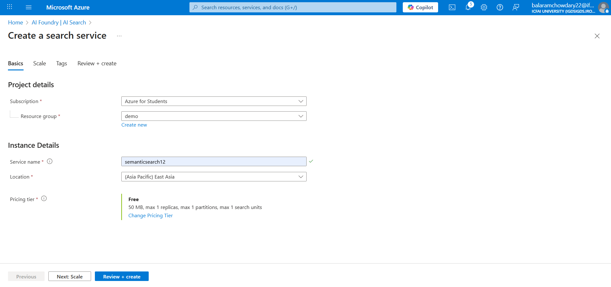

# 🚀 Global AI Bootcamp – Building Semantic Search with AI

📅 **Date:** 01 Nov 2025  
🕙 **Time:** 10:00 AM IST  
📍 **Location:** Microsoft, Hyderabad  
🔗 **Event Link:** [Register on Meetup](https://www.meetup.com/dot-net-learners-house-hyderabad/events/308109558/?eventOrigin=group_events_list)

**Speaker:** Nithin Reddy  
**Topic:** **From Text to Meaning: Semantic Search**  
🧠 **Live Demo:** Building a simple semantic search using Microsoft Azure Services

---

## ⚙️ Software / Tools

> 1. OS: Windows 10/11 x64  
> 2. Python 3.10+  
> 3. Visual Studio Code / Jupyter Notebook  
> 4. Azure OpenAI API key (for embeddings)  
> 5. Student Microsoft Azure Account

---

## 🧩 Prior Knowledge

> 1. Basic programming knowledge in Python  
> 2. Understanding of lists, loops, and basic APIs  
> 3. Familiarity with JSON and HTTP requests (optional)

---

---

## 🧠 Session Overview

Semantic Search goes beyond keywords — it understands **meaning**.  
In this session, we’ll explore how **embeddings** and **vector databases** enable this understanding.

You’ll learn how to:
- Convert text into numerical representations (embeddings)
- Store and search them efficiently in a vector database
- Build a mini **semantic search engine** powered by AI with Azure Ai Services

We’ll also discuss how this technology powers **ChatGPT**, **Notion AI**, and **Copilot** behind the scenes.

---

## 🔍 What We’ll Learn Today

1. **Why keyword search fails** – the gap between text and meaning  
2. **How embeddings work** – turning language into math  
3. **What vector databases do** – finding meaning through similarity search  
4. **Hands-on demo:** Build a semantic search using Azure Ai Services
5. **Applications:** How enterprises use it for RAG, chatbots, and document search  

---

---

## 🧰 Why Keyword Search Fails

## What Are Embeddings?

## Cosine Similarity

## Vector Databases

## Hands on Demo using Microsoft Azure

## Step-1 

Create a Microsoft Student Account using College email id
---
https://azure.microsoft.com/free/students
---

Click Start Free and create your free student account

## Step-2

Search for "Ai Search" and open it.

## Step-3

Click on Create Search Service

## Step-4

Fill the Details from the Screenshot below and service name can be named as you prefer.

## Step-5

Click Review + Create and then Click create again and Wait until validation and deployment gets completed.

## Step 6

Click Go to resource once down with deployment 

## Step 7

Click on the instance u have just created for me its sematicsearch12

## Step 8 

Click on Settings and then keys. Make Sure to copy the primary admin key which will be used later in the demo.

## Step 9

Now Search for Azure open ai in Main search bar, click and open it.

## Step 10

Click create and then click on Azure Open ai

## Step 11

Fill the basic config details as follows and instance name can be names as you prefer

## Step 12

Skip the network and tags tabs by clicking next and then click on create at the end after review and wait for deployment to be successful.

## Step 13 

Click on go to resource and then scroll down to click on "Explore Azure Ai Foundry Portal".

## Step 14

Go to Deployments tab in the new Azure ai foundry side nav and then click on Deploy and then on Deploy Base model

## Step 15

Search for text-embedding-3-small model in the avaiable models of open ai for creating embeddings and then click on create.

## Step 16

Click on Deploy with default config info

## Step 17

you will see this page of info regarding for our open ai deployment. please keep a note of deployment name and the model name and also copy the open ai key.

## Step 18 

Click on the below link to access and download the json file from my github.

---
https://github.com/Nithinreddy000/speaker-series-2025/blob/63e4f8bc2ff0794800768e5330d52502e3d9ff43/1101_Dotnet_MonthlyEvent/postman_json_file/vector_search.json
---

## Step 19

Make sure you have downloaded the postman desktop app
open postman and then click import-> files ->import the json file u just downloaded.

## Step 10

Click on Each one of the Request and click send one by one.

## Additional Steps if facing error with region validation

search for "Subscriptions" in search bar

Click Azure for Students and inside settings click policies

  

Expand option Authoring and then click on Assignments to find the option " Allowed resource deployment regions"

In the parameter value column you will find the avalaible deployment regions if facing issues use the allowed regions from policies while creating Ai search and Open ai Resources

## Recap and Real-World Use Cases

## Q/A

